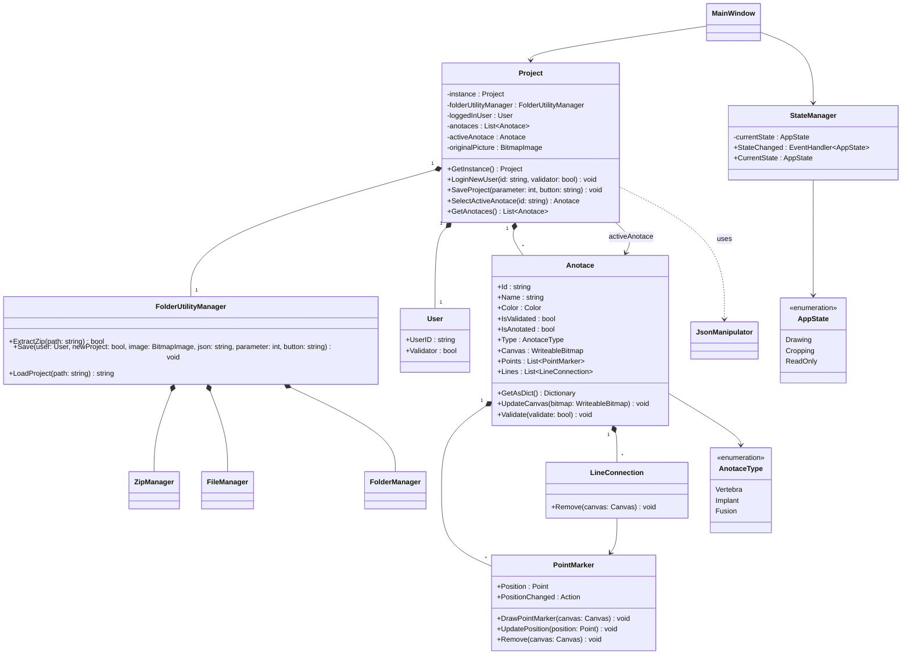
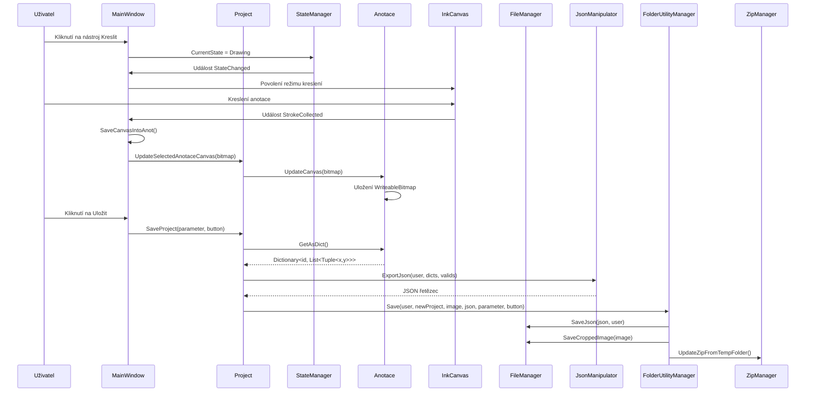
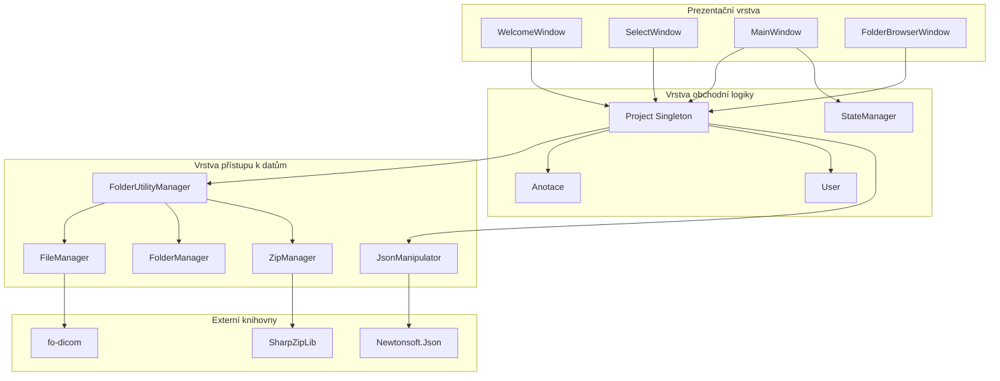

# VerteMark - Technická dokumentace

## 1. Přehled na vysoké úrovni

### Účel
VerteMark je desktopová aplikace založená na WPF, navržená pro anotaci rentgenových snímků krčních obratlů pro účely strojového učení. Aplikace umožňuje zdravotnickým pracovníkům (anotátorům a validátorům) označovat anatomické struktury, implantáty a fúze na DICOM snímcích.

### Hlavní případy použití
1. **Extrakce DICOM obrázků**: Extrahování PNG obrázků a metadat z DICOM souborů
2. **Anotace obrázků**: Anotace obratlů (C1-C7) pomocí bodových markerů nebo volného kreslení
3. **Označování implantátů/fúzí**: Označování implantátů a fúzí pomocí nástrojů pro kreslení
4. **Workflow validace**: Validátoři kontrolují a validují anotace vytvořené anotátory
5. **Správa projektů**: Organizace projektů v kontejnerovém formátu souborů (.vmk)

### Klíčová designová rozhodnutí
- **Singleton Pattern**: Třída `Project` používá singleton pattern pro udržení jedné instance projektu
- **Správa stavu**: `StateManager` spravuje stavy aplikace (Drawing, Cropping, ReadOnly)
- **Kontejnerový formát**: Používá ZIP-based kontejnerový formát (.vmk) pro organizaci projektů
- **Přístup založený na rolích**: Oddělené workflow pro anotátory a validátory
- **WPF architektura**: Využívá WPF InkCanvas pro kreslení a Canvas pro bodové anotace

### Architektonický styl
- **Model-View architektura**: Oddělení mezi obchodní logikou (ObjectClasses) a UI (MainWindows)
- **Manager Pattern**: FolderUtilityManager, FileManager, FolderManager koordinují operace se soubory
- **Event-Driven**: Změny stavu spouštějí aktualizace UI prostřednictvím událostí

---

## 2. Struktura projektu

```
VerteMark/
├── VerteMark/
│   ├── App.xaml / App.xaml.cs          # Vstupní bod aplikace, spouštěcí logika
│   ├── AssemblyInfo.cs                  # Metadata assembly
│   ├── VerteMark.csproj                 # Soubor projektu s závislostmi
│   │
│   ├── MainWindows/                    # Hlavní okna aplikace
│   │   ├── WelcomeWindow.xaml/cs       # Přihlášení uživatele a výběr role
│   │   ├── SelectWindow.xaml/cs        # Rozhraní pro výběr projektu
│   │   ├── FolderbrowserWindow.xaml/cs # Prohlížeč souborů/složek
│   │   ├── MainWindow.xaml/cs          # Hlavní rozhraní pro anotaci
│   │   └── GuideWindow.xaml/cs         # Uživatelská příručka/nápověda
│   │
│   ├── ObjectClasses/                  # Hlavní obchodní logika
│   │   ├── Project.cs                   # Singleton správce projektu
│   │   ├── StateManager.cs              # Správa stavu aplikace
│   │   ├── Anotace.cs                   # Entita anotace
│   │   ├── User.cs                      # Entita uživatele (anotátor/validátor)
│   │   ├── PointMarker.cs               # UI komponenta bodového markeru
│   │   ├── LineConnection.cs            # Čára spojující body
│   │   ├── JsonManipulator.cs           # JSON serializace/deserializace
│   │   ├── TreeStructure.cs             # 
│   │   │
│   │   └── FolderClasses/               # Operace se souborovým systémem
│   │       ├── FileManager.cs           # Extrakce DICOM, I/O operace se soubory
│   │       ├── FolderManager.cs         # Správa struktury složek
│   │       ├── FolderUtilityManager.cs  # Operace se složkami na vysoké úrovni
│   │       └── ZipManager.cs            # Operace s ZIP kontejnerem
│   │
│   ├── SubWindows/                      # Modální dialogy
│   │   ├── AboutWindow.xaml/cs
│   │   ├── SaveAlertWindow.xaml/cs
│   │   └── JustSaveAlertWindow.xaml/cs
│   │
│   ├── Resources/                       # Statické zdroje
│   │   ├── Gifs/                        # Animované návody
│   │   └── Icons/                       # Ikony aplikace
│   │
│   └── Pictures/                       # Debug/testovací obrázky
│
├── VerteMark.sln                        # Soubor solution
└── README.md                            # Přehled projektu
```

### Vysvětlení adresářů

- **MainWindows/**: Obsahuje hlavní okna aplikace implementující hlavní uživatelské workflow
- **ObjectClasses/**: Hlavní obchodní logika, datové modely a doménové entity
- **FolderClasses/**: Abstrakční vrstva souborového systému pro práci s DICOM, ZIP a operacemi se složkami
- **SubWindows/**: Modální dialogy pro uživatelské interakce (upozornění na uložení, o aplikaci)
- **Resources/**: Statické prostředky (ikony, GIFy) vložené do aplikace

---

## 3. Popis architektury

### Odpovědnosti komponent

#### **Project (Singleton)**
- Centrální koordinátor pro všechny operace projektu
- Spravuje seznam anotací (`Anotace`)
- Zpracovává stav autentizace uživatele
- Koordinuje operace se soubory prostřednictvím `FolderUtilityManager`
- Udržuje výběr aktivní anotace

#### **StateManager**
- Spravuje přechody stavu aplikace (Drawing, Cropping, ReadOnly)
- Publikuje události změny stavu do UI komponent
- Zajišťuje konzistenci UI na základě aktuálního stavu

#### **Anotace (Annotation)**
- Reprezentuje jednu entitu anotace
- Typy: Vertebra (bodová), Implant (kreslící), Fusion (kreslící)
- Ukládá bitmapu canvasu, bodové markery a stav validace
- Serializuje do JSON formátu pro perzistenci

#### **FileManager**
- Extrakce DICOM souborů a konverze na PNG
- Extrakce metadat z DICOM souborů
- I/O operace s JSON soubory
- Zpracovává transformace cest k souborům

#### **FolderManager**
- Spravuje strukturu dočasných složek:
  - `dicoms/`: Zdrojové DICOM soubory
  - `to_anotate/`: Projekty připravené k anotaci
  - `to_validate/`: Projekty připravené k validaci
  - `validated/`: Dokončené validované projekty
  - `invalid/`: Neplatné/zamítnuté projekty
- Zabraňuje duplicitním projektům napříč složkami

#### **ZipManager**
- Extrahuje .vmk (ZIP) kontejnerové soubory do dočasného adresáře
- Aktualizuje ZIP archiv ze změn v dočasné složce
- Zpracovává rekurzivní synchronizaci složek

#### **JsonManipulator**
- Serializuje anotace do JSON formátu
- Deserializuje JSON do objektů anotací
- Spravuje metadata uživatele (ID anotátora/validátora, časové značky)

### Tok dat

```
1. Přihlášení uživatele (WelcomeWindow)
   └─> Project.LoginNewUser()
       └─> Vytvoří instanci User

2. Výběr projektu (SelectWindow)
   └─> Project.ChooseProjectFolder()
       └─> ZipManager.ExtractZip()
           └─> FolderManager.CheckTempFolder()
               └─> Vytvoří strukturu složek

3. Načítání projektu
   └─> FolderUtilityManager.LoadProject()
       └─> FileManager.LoadBitmapImage()
       └─> JsonManipulator.UnpackJson()
           └─> Project.LoadAnnotations()
               └─> Vytvoří instance Anotace

4. Vytváření anotace
   └─> MainWindow (uživatelská interakce)
       └─> Project.SelectActiveAnotace()
           └─> InkCanvas/PointCanvas (kreslení/umístění bodů)
               └─> Anotace.UpdateCanvas() / Anotace.Points.Add()

5. Ukládání projektu
   └─> Project.SaveProject()
       └─> Anotace.GetAsDict() (serializace)
       └─> JsonManipulator.ExportJson()
       └─> FolderUtilityManager.Save()
           └─> FileManager.SaveJson() / SaveCroppedImage()
           └─> FolderManager.ProcessFolders() (úklid)
           └─> ZipManager.UpdateZipFromTempFolder()
```

### Externí závislosti

| Balíček | Verze | Účel |
|---------|-------|------|
| `fo-dicom` | 5.1.2 | Čtení DICOM souborů a extrakce obrázků |
| `fo-dicom.Desktop` | 4.0.8 | Desktop-specifická DICOM funkcionalita |
| `fo-dicom.Drawing` | 4.0.8 | Vykreslování DICOM obrázků |
| `Newtonsoft.Json` | 13.0.3 | JSON serializace/deserializace |
| `SharpZipLib` | 1.4.2 | Operace se ZIP soubory |
| `WpfAnimatedGif` | 2.0.2 | Zobrazení animovaných GIFů ve WPF |

---

## 4. UML diagramy

### Diagram tříd



### Sekvenční diagram - Workflow anotace



### Diagram komponent



---

## 5. Dokumentace veřejných tříd a metod

> **Poznámka:** Všechny veřejné třídy a metody jsou dokumentovány pomocí XML dokumentačních komentářů (///) přímo ve zdrojovém kódu. Tato sekce poskytuje přehled hlavních veřejných tříd a metod aplikace. Pro detailní dokumentaci včetně parametrů a návratových hodnot viz XML komentáře v kódu.

### Veřejné třídy a metody

#### **Project**

Třída Project je singleton, který spravuje celý projekt včetně anotací, uživatele a operací se soubory.

```csharp
/// <summary>
/// Získá singleton instanci třídy Project.
/// </summary>
/// <returns>Jediná instance Project</returns>
public static Project GetInstance()
```

```csharp
/// <summary>
/// Přihlásí nového uživatele do systému.
/// </summary>
/// <param name="id">Identifikátor uživatele</param>
/// <param name="validator">True, pokud je uživatel validátor, false pokud anotátor</param>
public void LoginNewUser(string id, bool validator)
```

---

```csharp
/// <summary>
/// Uloží aktuální projekt se všemi anotacemi, metadaty a obrázky.
/// </summary>
/// <param name="savingParameter">Parametr určující cílovou složku: 0 = to_anotate, 1 = to_validate, 2 = validated, 3 = invalid</param>
/// <param name="button">Název tlačítka, které spustilo uložení (pro metadata)</param>
public void SaveProject(int savingParameter, string button)
```

---

```csharp
public Anotace SelectActiveAnotace(string id)
```
**Parametry:**
- `id`: ID anotace (např. "V0", "V1", "I0", "F0")

**Vrací:** Vybranou instanci Anotace.

**Popis:** Nastaví aktivní anotaci pro editaci. Vrací objekt anotace.

---

```csharp
public List<Anotace> GetAnotaces()
```
**Vrací:** Seznam všech anotací v projektu.

---

```csharp
public Anotace CreateNewAnnotation(AnotaceType type)
```
**Parametry:**
- `type`: `AnotaceType.Implant` nebo `AnotaceType.Fusion`

**Vrací:** Nově vytvořenou instanci Anotace.

**Popis:** Vytvoří novou anotaci zadaného typu s automaticky vygenerovaným ID.

---

#### **StateManager**

Správce stavu aplikace spravuje přechody mezi stavy (Drawing, Cropping, ReadOnly) a publikuje události při změně.

```csharp
/// <summary>
/// Získá nebo nastaví aktuální stav aplikace.
/// Při nastavení vyvolá událost StateChanged.
/// </summary>
public AppState CurrentState { get; set; }

/// <summary>
/// Událost vyvolaná při změně stavu aplikace.
/// </summary>
public event EventHandler<AppState> StateChanged;
```

---

#### **Anotace**

Třída reprezentující jednu anotaci s identifikátorem, názvem, barvou a stavem validace.

```csharp
/// <summary>
/// Serializuje anotaci do formátu slovníku pro export do JSON.
/// Pro anotace obratlů vrací souřadnice bodů, pro kreslící anotace vrací souřadnice pixelů.
/// </summary>
/// <returns>Slovník mapující ID anotace na seznam souřadnicových n-tic (x, y)</returns>
public Dictionary<string, List<Tuple<int, int>>> GetAsDict()
```

---

```csharp
public void UpdateCanvas(WriteableBitmap bitmapSource)
```
**Parametry:**
- `bitmapSource`: WriteableBitmap obsahující nakreslenou anotaci

**Popis:** Aktualizuje bitmapu canvasu anotace novými daty kreslení.

---

```csharp
public void Validate(bool validate)
```
**Parametry:**
- `validate`: True pro označení jako validováno, false pro zrušení validace

**Popis:** Nastaví stav validace anotace.

---

#### **FileManager**

Správa a manipulace se soubory pro projekt včetně extrakce DICOM, konverze do PNG a ukládání metadat.

```csharp
/// <summary>
/// Extrahuje PNG obrázek z DICOM souboru a uloží ho do složky.
/// Nastaví vlastnosti pngPath a jsonPath.
/// </summary>
public void ExtractImageFromDicom()
```

**Poznámka:** Může vyvolat výjimky, pokud je DICOM soubor neplatný nebo nedostupný.

---

```csharp
public void ExtractAndSaveMetadata(User user)
```
**Parametry:**
- `user`: Instance User pro historii metadat

**Popis:** Extrahuje všechna DICOM metadata (File Meta Information a Dataset) a uloží do souboru `.meta` s historií akcí uživatele.

---

#### **FolderUtilityManager**

Správce operací se složkami na vysoké úrovni. Koordinuje práci mezi ZipManager, FileManager a FolderManager.

```csharp
/// <summary>
/// Extrahuje ZIP soubor projektu do dočasné složky.
/// </summary>
/// <param name="path">Cesta k ZIP souboru projektu (.vmk)</param>
/// <returns>True, pokud byla extrakce úspěšná, jinak false</returns>
public bool ExtractZip(string path)
```

---

```csharp
/// <summary>
/// Uloží projekt se všemi anotacemi, obrázky a metadaty.
/// </summary>
/// <param name="user">Uživatel provádějící uložení</param>
/// <param name="newProject">True, pokud se jedná o nový projekt, jinak false</param>
/// <param name="image">Obrázek k uložení</param>
/// <param name="jsonString">JSON řetězec s anotacemi</param>
/// <param name="savingParameter">Parametr určující cílovou složku: 0 = to_anotate, 1 = to_validate, 2 = validated, 3 = invalid</param>
/// <param name="button">Název tlačítka, které spustilo uložení (pro metadata)</param>
public void Save(User user, bool newProject, BitmapImage image, string jsonString, int savingParameter, string button)
```

---

```csharp
/// <summary>
/// Načte existující projekt ze zadané cesty.
/// </summary>
/// <param name="path">Cesta k projektu</param>
/// <returns>JSON řetězec s anotacemi nebo prázdný řetězec při chybě</returns>
public string LoadProject(string path)
```

---

```csharp
/// <summary>
/// Získá seznam DICOM souborů dostupných pro vytvoření nového projektu.
/// </summary>
/// <returns>Seznam názvů DICOM souborů</returns>
public List<string> ChooseNewProject()
```

---

#### **FolderManager**

Správce struktury složek v běhovém prostředí. Zajišťuje správnost temp složky a poskytuje nástroje pro výběr složek.

```csharp
/// <summary>
/// Zkontroluje správnost temp složky v běhovém prostředí.
/// Pokud nějaká složka chybí, vytvoří ji.
/// </summary>
public void CheckTempFolder()
```

---

```csharp
/// <summary>
/// Zpracuje složky a odstraní duplicitní složky mezi různými adresáři.
/// </summary>
/// <param name="button">Název tlačítka, které spustilo akci (určuje logiku mazání)</param>
public void ProcessFolders(string button)
```

---

```csharp
/// <summary>
/// Vrátí seznam DICOM souborů, pro které ještě není vytvořen projekt.
/// </summary>
/// <returns>Seznam názvů DICOM souborů dostupných pro vytvoření nového projektu</returns>
public List<string> ChooseNewProject()
```

---

#### **ZipManager**

Správce operací s ZIP kontejnerem projektu (.vmk soubory). Zajišťuje extrakci a aktualizaci ZIP archivu.

```csharp
/// <summary>
/// Načte a extrahuje ZIP soubor projektu do dočasné složky.
/// </summary>
/// <param name="zipPath">Cesta k ZIP souboru projektu</param>
public void LoadZip(string zipPath)
```

---

```csharp
/// <summary>
/// Aktualizuje ZIP archiv ze změn v dočasné složce.
/// </summary>
public void UpdateZipFromTempFolder()
```

---

#### **JsonManipulator**

Třída pro serializaci a deserializaci anotací do/z JSON formátu.

```csharp
/// <summary>
/// Exportuje anotace do JSON formátu.
/// </summary>
/// <param name="user">Uživatel (anotátor nebo validátor)</param>
/// <param name="programAnnotations">Seznam anotací ve formátu slovníku</param>
/// <param name="programValidatedAnnotations">Seznam ID validovaných anotací</param>
/// <returns>JSON řetězec obsahující anotace a metadata</returns>
public string ExportJson(User user, List<Dictionary<string, List<Tuple<int, int>>>> programAnnotations, List<string> programValidatedAnnotations)
```

---

```csharp
/// <summary>
/// Rozbalí JSON řetězec a vrátí seznam anotací a validovaných anotací.
/// </summary>
/// <param name="createdJson">JSON řetězec k rozbalení</param>
/// <returns>Seznam obsahující JArray anotací a JArray validovaných anotací, nebo null při chybě</returns>
public List<JArray>? UnpackJson(string createdJson)
```

---

#### **PointMarker**

Reprezentuje bodový marker pro anotace obratlů. Umožňuje zobrazení, přesouvání a škálování bodového markeru na canvasu.

```csharp
/// <summary>
/// Vytvoří novou instanci bodového markeru a okamžitě ho vykreslí na canvas.
/// </summary>
/// <param name="canvas">Canvas pro vykreslení markeru</param>
/// <param name="position">Počáteční pozice markeru</param>
/// <param name="colorBrush">Barva markeru</param>
/// <param name="label">Textový popisek markeru</param>
public PointMarker(Canvas canvas, Point position, Brush colorBrush, string label)
```

---

```csharp
/// <summary>
/// Aktualizuje pozici markeru na canvasu.
/// </summary>
/// <param name="newPosition">Nová pozice markeru</param>
public void UpdatePosition(Point newPosition)
```

---

```csharp
/// <summary>
/// Aktualizuje měřítko markeru.
/// </summary>
/// <param name="scale">Nové měřítko (1.0 = 100%)</param>
public void UpdateScale(double scale)
```

---

#### **LineConnection**

Reprezentuje čáru spojující dva bodové markery v anotaci. Automaticky aktualizuje svou pozici při pohybu markerů.

```csharp
/// <summary>
/// Vytvoří novou čáru spojující dva bodové markery.
/// </summary>
/// <param name="startPoint">Počáteční bodový marker</param>
/// <param name="endPoint">Koncový bodový marker</param>
/// <param name="canvas">Canvas pro vykreslení čáry</param>
/// <param name="colorBrush">Barva čáry</param>
public LineConnection(PointMarker startPoint, PointMarker endPoint, Canvas canvas, Brush colorBrush)
```

---

#### **TreeStructure (ButtonInfo, Subcategory, Category)**

Třídy pro hierarchickou strukturu uživatelské příručky.

```csharp
/// <summary>
/// Reprezentuje informace o tlačítku v uživatelské příručce.
/// </summary>
public class ButtonInfo
{
    /// <summary>Název tlačítka</summary>
    public string Title { get; set; }
    /// <summary>Cesta k GIF souboru s návodem</summary>
    public string GifPath { get; set; }
}
```

---

```csharp
/// <summary>
/// Reprezentuje podkategorii v hierarchii uživatelské příručky.
/// </summary>
public class Subcategory
{
    /// <summary>Název podkategorie</summary>
    public string Title { get; set; }
    /// <summary>Kolekce tlačítek v podkategorii</summary>
    public ObservableCollection<ButtonInfo> Buttons { get; set; }
}
```

---

```csharp
/// <summary>
/// Reprezentuje kategorii v hierarchii uživatelské příručky.
/// </summary>
public class Category
{
    /// <summary>Název kategorie</summary>
    public string Title { get; set; }
    /// <summary>Kolekce podkategorií v kategorii</summary>
    public ObservableCollection<Subcategory> Subcategories { get; set; }
}
```

---

#### **User**

Reprezentuje přihlášeného uživatele aplikace.

```csharp
/// <summary>
/// Reprezentuje přihlášeného uživatele aplikace.
/// </summary>
class User
{
    /// <summary>Identifikátor uživatele</summary>
    public string UserID { get; private set; }
    /// <summary>True, pokud je uživatel validátor, false pokud anotátor</summary>
    public bool Validator { get; private set; }
    
    /// <summary>
    /// Vytvoří novou instanci uživatele.
    /// </summary>
    /// <param name="id">Identifikátor uživatele</param>
    /// <param name="valid">True pro validátora, false pro anotátora</param>
    public User(string id, bool valid)
}
```

---

#### **MainWindow**

Hlavní okno aplikace pro anotaci rentgenových snímků. Poskytuje nástroje pro kreslení anotací, práci s obratli, implantáty a fúzemi.

```csharp
/// <summary>
/// Hlavní okno aplikace pro anotaci rentgenových snímků.
/// Poskytuje nástroje pro kreslení anotací, práci s obratli, implantáty a fúzemi.
/// </summary>
public partial class MainWindow : Window
{
    /// <summary>
    /// Vytvoří novou instanci MainWindow a inicializuje projekt, uživatele a UI komponenty.
    /// </summary>
    public MainWindow()
    
    /// <summary>
    /// Debugovací konstruktor pro testování bez DICOM souboru.
    /// </summary>
    /// <param name="debug">True pro aktivaci debug režimu</param>
    public MainWindow(bool debug)
    
    /// <summary>
    /// Načte všechny bodové markery ze všech anotací na PointCanvas.
    /// </summary>
    public void LoadPointMarkers()
}
```

**Hlavní metody (všechny jsou private event handlery):**
- `OpenProject_Click()` - Obsluha otevření projektu (Ctrl+O)
- `Save_Click()` - Obsluha uložení projektu (Ctrl+S)
- `CloseItem_Click()` - Obsluha zavření aplikace (Ctrl+Q)
- `UndoLastPoint()` - Odstraní poslední bod aktivní anotace (Ctrl+Z)
- `SwitchActiveAnot(string id)` - Přepne aktivní anotaci
- `LoadPointMarkers()` - Načte všechny bodové markery
- `CropImage()` - Ořízne obrázek podle vybrané oblasti
- `ZoomIn()`, `ZoomOut()` - Zvětšení/zmenšení zoomu
- A další metody pro správu UI a interakci s uživatelem

---

#### **WelcomeWindow**

Úvodní okno aplikace pro přihlášení uživatele a výběr role (anotátor/validátor).

```csharp
/// <summary>
/// Úvodní okno aplikace pro přihlášení uživatele a výběr role (anotátor/validátor).
/// </summary>
public partial class WelcomeWindow : Window
{
    /// <summary>
    /// Vytvoří novou instanci WelcomeWindow a inicializuje projekt.
    /// </summary>
    public WelcomeWindow()
    
    /// <summary>
    /// Obsluha kliknutí na tlačítko přihlášení - přihlásí uživatele a otevře SelectWindow.
    /// </summary>
    private void SignInButton_Click(object sender, RoutedEventArgs e)
    
    /// <summary>
    /// Změní nápovědu podle vybraného RadioButton (anotátor/validátor).
    /// </summary>
    private void RadioButton_Hint(object sender, RoutedEventArgs e)
    
    /// <summary>
    /// Otevře okno s uživatelskou příručkou.
    /// </summary>
    private void OpenGuide(object sender, RoutedEventArgs e)
    
    /// <summary>
    /// Otevře okno s informacemi o aplikaci.
    /// </summary>
    private void AboutItem_Click(object sender, RoutedEventArgs e)
}
```

---

#### **SelectWindow**

Okno pro výběr akce - vytvoření nového projektu nebo pokračování v práci.

```csharp
/// <summary>
/// Okno pro výběr akce - vytvoření nového projektu nebo pokračování v práci.
/// </summary>
public partial class SelectWindow : Window
{
    /// <summary>
    /// Vytvoří novou instanci SelectWindow a inicializuje projekt.
    /// </summary>
    public SelectWindow()
    
    /// <summary>
    /// Obsluha kliknutí na tlačítko pokračování - otevře FolderbrowserWindow.
    /// </summary>
    private void ContinueButton_Click(object sender, RoutedEventArgs e)
    
    /// <summary>
    /// Obsluha kliknutí na tlačítko výběru - otevře dialog pro výběr .vmk souboru.
    /// </summary>
    private void Select_Click(object sender, RoutedEventArgs e)
    
    /// <summary>
    /// Obsluha kliknutí na tlačítko zpět - vrátí se na WelcomeWindow.
    /// </summary>
    private void BackButton_Click(object sender, RoutedEventArgs e)
}
```

---

#### **FolderbrowserWindow**

Okno pro procházení a výběr projektů podle typu (nový projekt, pokračování, validace).

```csharp
/// <summary>
/// Okno pro procházení a výběr projektů podle typu (nový projekt, pokračování, validace).
/// </summary>
public partial class FolderbrowserWindow : Window
{
    /// <summary>Typ projektu (dicoms, to_anotate, to_validate, validated, invalid)</summary>
    string projectType;
    /// <summary>True, pokud bylo okno otevřeno z SelectWindow</summary>
    bool loadFromSelect;
    /// <summary>Reference na předchozí MainWindow (pokud existuje)</summary>
    public MainWindow? oldMainWindow;
    
    /// <summary>
    /// Vytvoří novou instanci FolderbrowserWindow.
    /// </summary>
    /// <param name="fromSelect">True, pokud bylo okno otevřeno z SelectWindow, jinak false</param>
    public FolderbrowserWindow(bool fromSelect)
    
    /// <summary>
    /// Obsluha kliknutí na tlačítko pokračování - načte vybraný projekt a otevře MainWindow.
    /// </summary>
    private void ContinueButton_Click(object sender, RoutedEventArgs e)
    
    /// <summary>
    /// Aktualizuje seznam souborů podle vybraného typu projektu (RadioButton).
    /// </summary>
    private void UpdateFileList()
    
    /// <summary>
    /// Načte seznam souborů podle role uživatele (anotátor/validátor).
    /// </summary>
    void LoadforRole()
}
```

---

#### **GuideWindow**

Okno s uživatelskou příručkou obsahující hierarchickou strukturu návodů s GIF animacemi.

```csharp
/// <summary>
/// Okno s uživatelskou příručkou obsahující hierarchickou strukturu návodů s GIF animacemi.
/// </summary>
public partial class GuideWindow : Window
{
    /// <summary>Kolekce kategorií návodů</summary>
    public ObservableCollection<Category> Categories { get; set; }
    
    /// <summary>
    /// Vytvoří novou instanci GuideWindow a načte kategorie návodů.
    /// </summary>
    public GuideWindow()
    
    /// <summary>
    /// Načte a inicializuje kategorie návodů s jejich podkategoriemi a tlačítky.
    /// </summary>
    private void LoadCategories()
    
    /// <summary>
    /// Obsluha kliknutí na tlačítko návodu - zobrazí GIF animaci.
    /// </summary>
    private void Button_Click(object sender, RoutedEventArgs e)
}
```

---

#### **JustSaveAlertWindow**

Okno pro uložení projektu s možností výběru cílové složky (to_validate, validated, invalid).

```csharp
/// <summary>
/// Okno pro uložení projektu s možností výběru cílové složky (to_validate, validated, invalid).
/// </summary>
public partial class JustSaveAlertWindow : Window
{
    /// <summary>
    /// Vytvoří novou instanci JustSaveAlertWindow.
    /// </summary>
    /// <param name="mainWindow">Reference na hlavní okno</param>
    /// <param name="validator">True, pokud je uživatel validátor</param>
    /// <param name="saveButton">True, pokud bylo okno otevřeno z tlačítka Save</param>
    /// <param name="sourceButtonName">Název tlačítka, které okno otevřelo</param>
    public JustSaveAlertWindow(MainWindow mainWindow, bool validator, bool saveButton, string sourceButtonName)
    
    /// <summary>
    /// Uloží projekt do složky to_validate (anotátor) nebo validated (validátor).
    /// </summary>
    private void SendForValidation_Click(object sender, RoutedEventArgs e)
    
    /// <summary>
    /// Uloží projekt do složky validated.
    /// </summary>
    private void ValidateButton_Click(object sender, RoutedEventArgs e)
    
    /// <summary>
    /// Otevře okno FolderbrowserWindow pro výběr projektu.
    /// </summary>
    /// <param name="select">True pro výběr nového .vmk souboru, false pro návrat do okna se seznamem DICOMů</param>
    public void Browse(bool select)
}
```

---

#### **AboutWindow**

Okno s informacemi o aplikaci VerteMark.

```csharp
/// <summary>
/// Okno s informacemi o aplikaci VerteMark.
/// </summary>
public partial class AboutWindow : Window
{
    /// <summary>
    /// Vytvoří novou instanci AboutWindow.
    /// </summary>
    public AboutWindow()
    
    /// <summary>
    /// Obsluha kliknutí na tlačítko OK - zavře okno.
    /// </summary>
    private void okButton_Click(object sender, RoutedEventArgs e)
}
```

---

#### **App**

Hlavní třída aplikace WPF. Spravuje inicializaci a životní cyklus aplikace.

```csharp
/// <summary>
/// Hlavní třída aplikace WPF. Spravuje inicializaci a životní cyklus aplikace.
/// </summary>
public partial class App : Application
{
    /// <summary>
    /// Obsluha spuštění aplikace - inicializuje kódování a kontroluje verzi Windows.
    /// </summary>
    /// <param name="e">Argumenty spuštění</param>
    protected override void OnStartup(StartupEventArgs e)
    
    /// <summary>
    /// Zjistí, zda je verze Windows 8.1 nebo novější.
    /// </summary>
    /// <returns>True, pokud je Windows 8.1 nebo novější, jinak false</returns>
    private bool IsWindows81OrNewer()
    
    /// <summary>
    /// Restartuje aplikaci a předá parametr "allDone".
    /// </summary>
    public static void RestartApplication()
}
```

---

### Příklad použití

```csharp
// Inicializace projektu
Project project = Project.GetInstance();
project.LoginNewUser("user123", false); // Anotátor

// Načtení projektu ze ZIP
FolderUtilityManager folderUtil = project.folderUtilityManager;
bool extracted = folderUtil.ExtractZip(@"C:\Projects\project.vmk");
if (extracted) {
    string json = folderUtil.LoadProject(@"C:\temp\VerteMark\project\to_anotate\project_name");
    // Projekt načte anotace z JSON
}

// Vytvoření nové anotace
Anotace newImplant = project.CreateNewAnnotation(AnotaceType.Implant);
// newImplant.Id = "I1", newImplant.Name = "Implantát 2"

// Výběr a anotace
Anotace active = project.SelectActiveAnotace("V0"); // Vybrat obratel C1
// Uživatel kreslí na canvas...
project.UpdateSelectedAnotaceCanvas(renderedBitmap);

// Uložení projektu
project.SaveProject(0, "SaveButton"); // Uložit do složky to_anotate
```

---

## 6. Datové modely

### Klíčové entity

#### **Anotace (Annotation)**
Reprezentuje jednu anotaci na rentgenovém snímku.

**Vlastnosti:**
- `Id`: Jedinečný identifikátor (např. "V0", "V1", "I0", "F0")
- `Name`: Zobrazovaný název (např. "C1", "C2", "Implantát")
- `Color`: System.Drawing.Color pro vizualizaci
- `Type`: Enum `AnotaceType` (Vertebra, Implant, Fusion)
- `IsValidated`: Boolean stav validace
- `IsAnotated`: Boolean označující, zda má anotace obsah
- `Canvas`: WriteableBitmap pro kreslící anotace
- `Points`: List<PointMarker> pro bodové anotace (Vertebra)
- `Lines`: List<LineConnection> spojující body

**Pravidla validace:**
- Anotace obratlů: Maximálně 8 bodů (štítky A-H)
- Anotace implantátů/fúzí: Kreslící, bez limitu bodů
- Formát ID: Předpona (V/I/F) + číselný index

#### **User**
Reprezentuje přihlášeného uživatele.

**Vlastnosti:**
- `UserID`: Řetězcový identifikátor
- `Validator`: Boolean příznak role

**Omezení:**
- UserID nemůže být prázdný (vynuceno v WelcomeWindow)

#### **PointMarker**
Reprezentuje jeden bodový marker na canvasu pro anotace obratlů.

**Vlastnosti:**
- `Position`: System.Windows.Point (souřadnice x, y) - pozice markeru na canvasu
- `_scaleTransform`: ScaleTransform - transformace pro škálování markeru
- `PositionChanged`: event Action - událost vyvolaná při změně pozice

**Chování:**
- Uživatelsky přetahovatelný pomocí myši
- Aktualizuje připojené objekty LineConnection při změně pozice
- Měřítkuje se s úrovní zoomu pomocí UpdateScale()
- Zobrazuje textový popisek (A-H pro obratle)
- Má hitbox pro snadnější zachycení myší

#### **LineConnection**
Spojuje dvě instance PointMarker čárou.

**Vlastnosti:**
- `_startPoint`: PointMarker - počáteční bod
- `_endPoint`: PointMarker - koncový bod (veřejná vlastnost)
- `_line`: Line - WPF čára pro vykreslení

**Chování:**
- Automaticky aktualizuje pozici čáry při pohybu připojených bodů
- Odstraněn při smazání kteréhokoli bodu
- Přihlašuje se k událostem PositionChanged obou markerů
- Má 50% průhlednost a tloušťku 3 pixely

#### **JsonManipulator**
Třída pro serializaci a deserializaci anotací do/z JSON formátu.

**Vlastnosti:**
- `ValidatorID`: string? - ID validátora
- `AnnotatorID`: string? - ID anotátora
- `LastEditDate`: string? - datum a čas poslední úpravy
- `ValidationDate`: string? - datum a čas validace
- `Annotations`: List<Dictionary<string, List<Tuple<int, int>>>>? - seznam anotací
- `ValidatedAnnotations`: List<string>? - seznam ID validovaných anotací

**Metody:**
- `ExportJson()`: Vytvoří JSON řetězec z anotací a metadat
- `UnpackJson()`: Rozbalí JSON řetězec a vrátí seznam anotací

#### **FolderUtilityManager**
Správce operací se složkami na vysoké úrovni.

**Vlastnosti:**
- `fileManager`: FileManager - správce souborových operací
- `tempPath`: string - cesta k dočasné složce projektu

**Hlavní metody:**
- `ExtractZip()`: Extrahuje ZIP soubor projektu
- `Save()`: Uloží projekt se všemi daty
- `LoadProject()`: Načte existující projekt
- `CreateNewProject()`: Vytvoří nový projekt z DICOM souboru
- `ChooseNewProject()`, `ChooseContinueAnotation()`, `ChooseValidation()`: Získání seznamů projektů

#### **FolderManager**
Správce struktury složek v běhovém prostředí.

**Vlastnosti:**
- `tempFolderPath`: string? - cesta k dočasné složce

**Hlavní metody:**
- `CheckTempFolder()`: Zkontroluje a vytvoří potřebné složky
- `ProcessFolders()`: Zpracuje složky a odstraní duplicity
- `ChooseNewProject()`, `ChooseContinueAnotation()`, `ChooseValidation()`: Získání seznamů projektů podle stavu

#### **ZipManager**
Správce operací s ZIP kontejnerem projektu (.vmk soubory).

**Vlastnosti:**
- `zipPath`: string? - cesta k ZIP souboru
- `tempFolderPath`: string? - cesta k dočasné složce pro extrakci
- `zipName`: string? - název ZIP souboru bez přípony

**Hlavní metody:**
- `LoadZip()`: Načte a extrahuje ZIP soubor
- `UpdateZipFromTempFolder()`: Aktualizuje ZIP archiv ze změn v dočasné složce

#### **TreeStructure (ButtonInfo, Subcategory, Category)**
Třídy pro hierarchickou strukturu uživatelské příručky.

**ButtonInfo:**
- `Title`: string - název tlačítka
- `GifPath`: string - cesta k GIF souboru s návodem

**Subcategory:**
- `Title`: string - název podkategorie
- `Buttons`: ObservableCollection<ButtonInfo> - kolekce tlačítek

**Category:**
- `Title`: string - název kategorie
- `Subcategories`: ObservableCollection<Subcategory> - kolekce podkategorií

### Vztahy dat

```
Project (1) ──< (*) Anotace
Anotace (1) ──< (*) PointMarker
Anotace (1) ──< (*) LineConnection
LineConnection (1) ──> (2) PointMarker
Project (1) ──> (1) User
```

### Formát JSON dat

**Exportní formát:**
```json
{
  "AnnotatorID": "user123",
  "LastEditDate": "20. 10. 2025 14:30:00",
  "ValidatorID": null,
  "ValidationDate": null,
  "Annotations": [
    {
      "V0": [[100, 200], [150, 250], ...]
    },
    {
      "I0": [[50, 60], [51, 61], ...]
    }
  ],
  "ValidatedAnnotations": ["V0", "V1", "V2"]
}
```

**Data anotace:**
- Anotace obratlů: Seznam n-tic `[x, y]` pro každý bod
- Anotace implantátů/fúzí: Seznam n-tic `[x, y]` pro každý anotovaný pixel

---

## 7. Konfigurace

### Proměnné prostředí
Žádné nejsou vyžadovány. Aplikace používá standardní cesty Windows prostředí.

### Konfigurační soubory
Žádné externí konfigurační soubory. Nastavení jsou hardcodovaná nebo odvozená z běhového prostředí.

### Běhová konfigurace

**Dočasný adresář:**
- Výchozí: `%TEMP%\VerteMark\{zipName}\`
- Nastaveno přes `ZipManager.tempFolderPath` během extrakce ZIP

**Výstupní adresář:**
- Výchozí: `Environment.SpecialFolder.Desktop`
- Upravováno během operací ukládání projektu

**Klíč metadat:**
- Hardcodováno: `"XX"` (v `FileManager.key`)
- Používá se jako předpona pro metadata soubory: `XX-{filename}.meta`

### Struktura složek (Dočasná)
```
temp/
└── VerteMark/
    └── {project_name}/
        ├── dicoms/          # Zdrojové DICOM soubory
        ├── to_anotate/      # Projekty k anotaci
        │   └── {dicom_name}/
        │       ├── {filename}.png
        │       ├── a_{filename}.json
        │       └── XX-{filename}.meta
        ├── to_validate/     # Projekty připravené k validaci
        ├── validated/       # Dokončené validované projekty
        └── invalid/         # Neplatné/zamítnuté projekty
```

---

## 8. Zpracování chyb a logování

### Strategie chyb

**Zpracování výjimek:**
- Většina operací se soubory používá try-catch bloky s tichým selháním
- Kritické chyby zobrazují uživateli dialogy MessageBox
- Selhání extrakce DICOM vrací `null` z `LoadBitmapImage()`
- ZIP operace zachytávají výjimky, ale nepropagují je (logují do konzole)

**Běžné scénáře selhání:**

1. **Neplatný/poškozený DICOM soubor**
   - Umístění: `FileManager.ExtractImageFromDicom()`
   - Zpracování: Výjimka zachycena, vrací null bitmapu
   - Dopad na uživatele: Obrázek se nenačte, uživatel vidí chybu

2. **Selhání extrakce ZIP**
   - Umístění: `ZipManager.LoadZip()`
   - Zpracování: Výjimka zachycena, loguje do konzole, vrací false
   - Dopad na uživatele: Výběr projektu selže

3. **Chyba parsování JSON**
   - Umístění: `JsonManipulator.UnpackJson()`
   - Zpracování: Vrací null, projekt vytvoří výchozí anotace
   - Dopad na uživatele: Existující anotace ztraceny, začíná se znovu

4. **Soubor nenalezen**
   - Umístění: `FileManager.CopyMetaFile()`
   - Zpracování: Vyvolá `FileNotFoundException`
   - Dopad na uživatele: Operace uložení může selhat

5. **Nekompatibilita verze Windows**
   - Umístění: `App.OnStartup()`
   - Zpracování: Zobrazí varovný dialog, umožní uživateli pokračovat nebo ukončit
   - Dopad na uživatele: Některé fonty/funkce se nemusí zobrazit správně

### Logování
- **Výstup konzole**: Používá se v `ZipManager` pro stav extrakce
- **Debug výstup**: `Debug.WriteLine()` používáno v `Project.LoginNewUser()` a `FolderUtilityManager.LoadProject()`
- **Žádné strukturované logování**: Aplikace nepoužívá framework pro logování

### Hlášení chyb
- Hlášení chyb pro uživatele přes email: `software@digitech.ujep.cz`
- Formát hlášení chyby: "BUG - VerteMark - {popis}"

---

## 9. Bezpečnostní aspekty

### Autentizace / Autorizace

**Současná implementace:**
- **Žádná autentizace**: ID uživatele se zadává jako prostý text, bez ověření
- **Přístup založený na rolích**: Role (anotátor/validátor) určena výběrem radio buttonu
- **Žádná ochrana heslem**: Kdokoli může zadat jakékoli ID uživatele

**Bezpečnostní implikace:**
- Identita uživatele nemůže být ověřena
- Žádná auditní stopa, kdo provedl akce (kromě řetězce ID uživatele)
- Metadata ukládají ID uživatele, ale nemohou zaručit autentičnost

### Zpracování citlivých dat

**DICOM metadata:**
- Všechna DICOM metadata extrahována a uložena v souborech `.meta`
- Může obsahovat PHI (Protected Health Information)
- Soubory uloženy v dočasném adresáři (mohou přetrvat po ukončení aplikace)
- Žádné šifrování uložených dat

**Doporučení:**
- Implementovat správný mechanismus autentizace
- Šifrovat citlivé metadata soubory
- Zabezpečit úklid dočasného adresáře
- Implementovat auditní logování s ověřenou identitou uživatele

---

## 10. Poznámky k výkonu a škálovatelnosti

### Problémová místa výkonu

1. **Vykreslování bitmapy**
   - Umístění: `MainWindow.SaveCanvasIntoAnot()`
   - Problém: `RenderTargetBitmap.Render()` voláno při každém dokončení tahu
   - Dopad: Může způsobit zpomalení uživatelského rozhraní na velkých obrázcích nebo při častém kreslení

2. **Aktualizace ZIP archivu**
   - Umístění: `ZipManager.UpdateZipFromTempFolder()`
   - Problém: Rekurzivní prohledávání složek a mazání záznamů při každém uložení
   - Dopad: Pomalé operace ukládání pro velké projekty

3. **Operace s bitmapou canvasu**
   - Umístění: `Anotace.BitmapAsList()`
   - Problém: Iteruje přes všechny pixely pro nalezení anotovaných pixelů
   - Dopad: Pomalá serializace pro velké, silně anotované obrázky

4. **Aktualizace bodových markerů**
   - Umístění: `Project.UpdatePointsScale()`
   - Problém: Aktualizuje všechny body pro všechny anotace při změně zoomu
   - Dopad: Výkon se zhoršuje s mnoha anotacemi

### Úvahy o optimalizaci

1. **Odložené vykreslování**: Vykreslovat bitmapu canvasu pouze při ukládání, ne při každém tahu
2. **Inkrementální aktualizace ZIP**: Sledovat změněné soubory a aktualizovat pouze tyto záznamy
3. **Ukládání pixelů do mezipaměti**: Ukládat seznamy anotovaných pixelů do mezipaměti místo přepočítávání
4. **Virtualizace UI**: Pro projekty s mnoha anotacemi implementovat virtualizaci uživatelského rozhraní
5. **Asynchronní operace**: Přesunout I/O operace na pozadí, aby se zabránilo blokování uživatelského rozhraní

### Omezení škálovatelnosti

- **Velikost obrázku**: Žádné explicitní limity, ale velké obrázky (>4K) mohou způsobit problémy s pamětí
- **Počet anotací**: Výchozí 9 anotací (7 obratlů + 1 implantát + 1 fúze), podporováno dynamické přidávání
- **Počet bodů**: Maximálně 8 bodů na anotaci obratle (hardcodováno)
- **Souběžní uživatelé**: Jednouživatelská aplikace, žádná podpora více uživatelů

---

## 11. Testování

### Testovací strategie

**Debug režim:**
- Debug konstruktor v `MainWindow(bool debug)` pro testování bez projektových souborů
- Načítá debug obrázek z `Pictures/debug.png`

### Doporučený přístup k testování

1. **Unit testy:**
   - Metody třídy `Project` (správa anotací, přihlášení uživatele)
   - Serializace/deserializace `JsonManipulator`
   - Logika extrakce DICOM v `FileManager`

2. **Integrační testy:**
   - End-to-end workflow ukládání/načítání projektu
   - Testování round-trip ZIP kontejneru
   - Správa struktury složek

3. **UI testy:**
   - Přesnost kreslení anotací
   - Umístění a přetahování bodových markerů
   - Přechody stavů

---

## 12. Nasazení

### Kroky sestavení

**Předpoklady:**
- .NET 9.0 SDK
- Windows 10 22H2 nebo Windows 11
- Visual Studio 2022 (doporučeno) nebo .NET CLI

**Příkaz sestavení:**
```bash
dotnet build VerteMark.sln --configuration Release
```

**Výstup:**
- Spustitelný soubor: `VerteMark/bin/Release/net9.0-windows10.0.26100.0/VerteMark.exe`
- Závislosti: Zahrnuty přes NuGet balíčky

### Běhové požadavky

**Operační systém:**
- Windows 10 22H2 (minimum)
- Windows 11 (doporučeno)

**Závislosti:**
- .NET 9.0 Runtime (Windows Desktop)
- Všechny NuGet balíčky jsou zahrnuty ve výstupu sestavení

**Místo na disku:**
- Aplikace: ~50 MB (odhad)
- Dočasné soubory: Liší se podle velikosti projektu (typicky 10-100 MB na projekt)

### Nasazovací prostředí

**Vývoj:**
- Lokální počítač s Visual Studio
- Debug sestavení pro testování

**Produkce:**
- Release sestavení distribuované koncovým uživatelům
- Žádný instalátor - přímá distribuce spustitelného souboru
- Uživatelé musí mít nainstalovaný .NET 9.0 Runtime

**Nasazovací balíček:**
- Jeden spustitelný soubor + složka závislostí
- Nebo použít ClickOnce/MSI instalátor (momentálně neimplementováno)

---

## 13. Průvodce údržbou a rozšířením

### XML Dokumentace

Všechny veřejné třídy a metody jsou dokumentovány pomocí XML dokumentačních komentářů (///). Tyto komentáře jsou zahrnuty ve zdrojovém kódu a mohou být použity pro:

- **IntelliSense v IDE**: Automatické zobrazení dokumentace při psaní kódu
- **Generování dokumentace**: Pomocí nástrojů jako DocFX nebo Sandcastle
- **Lepší čitelnost kódu**: Dokumentace přímo u zdrojového kódu

**Formát XML komentářů:**
```csharp
/// <summary>
/// Stručný popis metody nebo třídy.
/// </summary>
/// <param name="paramName">Popis parametru</param>
/// <returns>Popis návratové hodnoty</returns>
/// <exception cref="ExceptionType">Kdy je vyvolána výjimka</exception>
```

**Hlavní třídy s XML dokumentací:**
- `Project` - Všechny veřejné metody
- `Anotace` - Všechny veřejné metody a vlastnosti
- `StateManager` - Vlastnosti a události
- `User` - Konstruktor a vlastnosti
- `FileManager` - Hlavní veřejné metody
- `FolderUtilityManager` - Všechny veřejné metody
- `FolderManager` - Všechny metody
- `ZipManager` - Všechny metody
- `JsonManipulator` - Všechny metody a vlastnosti
- `PointMarker` - Všechny metody a vlastnosti
- `LineConnection` - Konstruktor a metody
- `TreeStructure` (ButtonInfo, Subcategory, Category) - Všechny vlastnosti
- `MainWindow` - Hlavní konstruktory a metody
- `WelcomeWindow` - Všechny metody
- `SelectWindow` - Všechny metody
- `FolderbrowserWindow` - Všechny metody a vlastnosti
- `GuideWindow` - Všechny metody a vlastnosti
- `JustSaveAlertWindow` - Všechny metody
- `AboutWindow` - Konstruktor a metody
- `App` - Všechny metody

### Jak přidat nové funkce

#### **Přidání nového typu anotace**

1. **Aktualizace enum AnotaceType:**
   ```csharp
   // V Anotace.cs
   public enum AnotaceType {
       Vertebra,
       Implant,
       Fusion,
       NewType  // Přidat zde
   }
   ```

2. **Aktualizace Project.CreateNewAnnotation():**
   - Přidat případ pro nový typ v přiřazení barvy/názvu
   - Aktualizovat logiku předpony ID, pokud je potřeba

3. **Aktualizace MainWindow:**
   - Přidat UI tlačítko pro nový typ v `CreateButtons()`
   - Zpracovat chování specifické pro typ v `SwitchActiveAnot()`

4. **Aktualizace serializace:**
   - Zajistit, že `Anotace.GetAsDict()` správně zpracovává nový typ
   - Aktualizovat `Project.LoadAnnotations()`, pokud se načítání liší

#### **Přidání nového nástroje**

1. **Přidat tlačítko na panel nástrojů:**
   - Přidat ToggleButton do panelu nástrojů MainWindow.xaml
   - Propojit obslužnou rutinu kliknutí

2. **Aktualizovat StateManager (pokud je potřeba):**
   - Přidat novou hodnotu enum `AppState`
   - Aktualizovat switch příkaz v `HandleStateChanged()`

3. **Implementovat logiku nástroje:**
   - Přidat obslužnou metodu v MainWindow.xaml.cs
   - Integrovat s Project/Anotace podle potřeby

#### **Úprava formátu souboru**

1. **Aktualizovat JsonManipulator:**
   - Upravit `ExportJson()` pro zahrnutí nových polí
   - Aktualizovat `UnpackJson()` pro čtení nových polí

2. **Aktualizovat Project:**
   - Upravit `SaveProject()` pro předání nových dat
   - Aktualizovat `LoadProject()` pro zpracování nového formátu

3. **Migrace verzí:**
   - Zvážit přidání pole verze do JSON
   - Implementovat migrační logiku pro staré formáty

### Kódovací konvence

**Pojmenování:**
- Třídy: PascalCase (`Project`, `Anotace`)
- Metody: PascalCase (`SaveProject`, `GetAnotace`)
- Privátní pole: camelCase (`activeAnotace`, `loggedInUser`)
- Veřejné vlastnosti: PascalCase (`UserID`, `IsValidated`)

**Organizace souborů:**
- Jedna třída na soubor
- Namespace odpovídá struktuře složek
- Code-behind XAML ve stejném namespace

**Komentáře:**
- Komentáře v kódu v češtině (dědictví)
- XML dokumentační komentáře na veřejných metodách (řídké)
- TODO komentáře označují známé problémy

### Známá omezení

1. **Pouze Windows**: Aplikace cílí na Windows-specifický WPF framework
2. **Jeden projekt**: Singleton pattern brání více souběžným projektům
3. **Žádné Undo/Redo**: Pouze jednourovňové undo (odstranění posledního bodu)
4. **Pevný počet anotací**: Výchozí 7 obratlů, musí se ručně přidat více implantátů/fúzí
5. **Žádné exportní formáty**: Ukládá pouze do interního formátu .vmk
6. **Použití paměti**: Velké obrázky a mnoho anotací mohou způsobit vysoké použití paměti
7. **Žádná spolupráce**: Jednouživatelská aplikace, žádná podpora více uživatelů
8. **Dočasné soubory**: Dočasná složka nemusí být vyčištěna při pádu

### Body rozšíření

1. **Vlastní typy anotací**: Systém založený na enum umožňuje snadné přidávání
2. **Exportní formáty**: `JsonManipulator` může být rozšířen pro jiné formáty (XML, CSV)
3. **Plugin systém**: Architektura by mohla podporovat pluginy pro vlastní nástroje
4. **Databázové backend**: Nahradit úložiště založené na souborech databází
5. **Integrace Web API**: Přidat REST API pro vzdálenou správu projektů
6. **Podpora více uživatelů**: Refaktorovat singleton pro podporu souběžných relací

---

## Dodatek A: Slovník

- **Anotace**: Český termín pro "annotation"
- **DICOM**: Digital Imaging and Communications in Medicine - standard pro lékařské zobrazování
- **VMK**: Formát kontejnerového souboru VerteMark (ZIP archiv)
- **Validátor**: Validator (česky)
- **Anotátor**: Annotator (česky)
- **Fúze**: Fusion (česky)
- **Implantát**: Implant (česky)

---

## Dodatek B: Reference

- **fo-dicom dokumentace**: https://github.com/fo-dicom/fo-dicom
- **WPF dokumentace**: https://docs.microsoft.com/en-us/dotnet/desktop/wpf/
- **DICOM standard**: https://www.dicomstandard.org/
- **Repozitář projektu**: https://github.com/hnklp/VerteMark

---

**Verze dokumentu**: 1.0  
**Poslední aktualizace**: 2025-12-18  
**Autor**: Tým VerteMark
